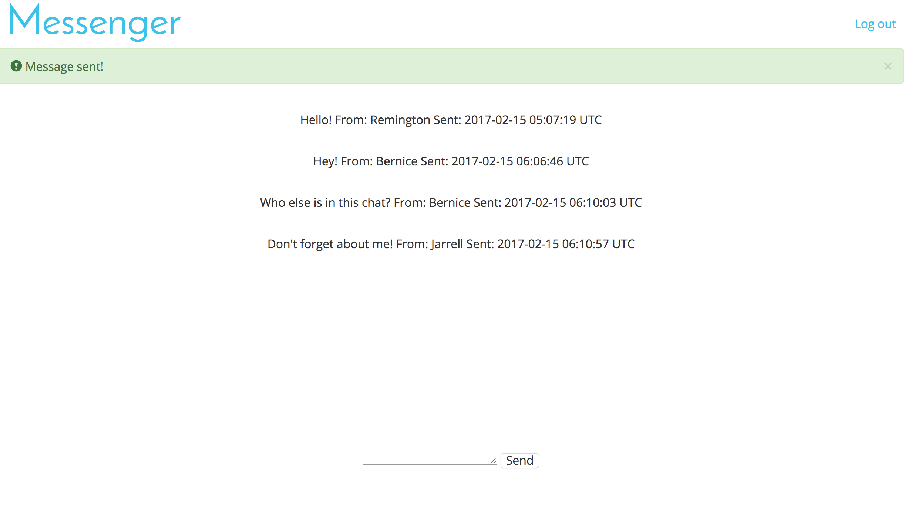
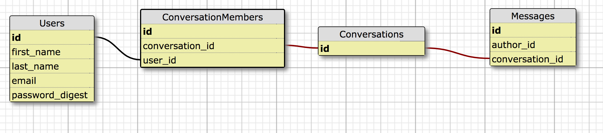

# README

This is a simple messaging application that uses

### Setup

```
git clone git@github.com:tmikeschu/simple_messager.git
cd simple_messenger
bundle
rake db:setup
clear & rspec
```

### Running Locally
```
rails s
open http://localhost:3000
```
Sample user credentials:

user@example.com

password

#### Sample conversation view


#### Database Schema

